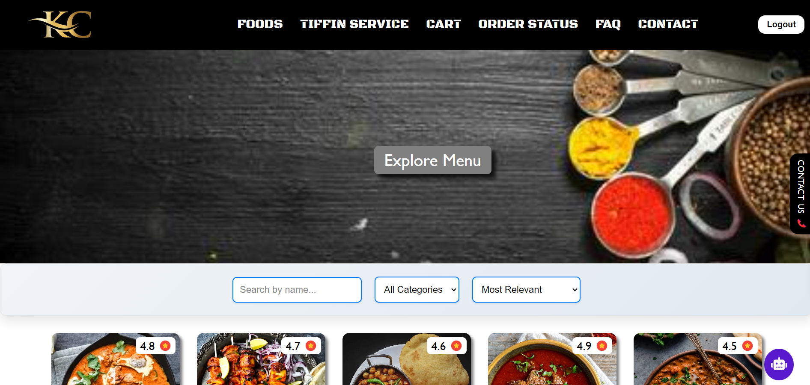

# 🍽️ KC Restaurant

**KC Restaurant** is a web application designed to provide users with an interactive and seamless experience for ordering food and tiffin services online. The application features a modern design with engaging background animations, a chatbot for real-time assistance, and various other functionalities to enhance user experience.



## 🌟 Features

- **🍲 Food**: Browse through a variety of food items with detailed information and filtering options to find exactly what you want.
- **🥘 Tiffin Service**: Explore tiffin services with customizable meal options and durations, allowing you to select the perfect meal plan for your needs.
- **🛒 Cart**: Easily add, view, and manage your selected items before placing an order.
- **📦 Order Status**: Check the real-time status of your orders, from preparation to delivery.
- **❓ FAQ**: Find answers to common questions related to services, delivery, and more.
- **📞 Contact**: Get in touch with us for any inquiries or support.
- **💬 Chatbot**: A chatbot is available in the bottom left corner to assist with order queries, delivery issues, and more. It toggles open/close on a message icon click.
- **💵 Payment**: Seamlessly pay for your food and tiffin services using the Razorpay payment gateway, which ensures secure and efficient transactions. The payment process is integrated into the application, allowing users to complete their purchases with ease.
- **🍲 Recipes**: Get recipes for various dishes by entering the dish name. The application generates recipes using advanced AI, providing detailed instructions and ingredients.
- **🔑 Login/Signup**: Secure authentication system powered by Firebase, allowing users to create accounts and log in to manage their orders.

## 🛠️ Tech Stack

- **React.js**: A JavaScript library for building user interfaces.
- **Firebase**: Used for backend services including authentication, database, and hosting.
- **React Icons**: For the elegant and responsive icons used throughout the application.
- **CSS Animations**: Advanced CSS techniques for background animations, including moving star shapes.

## 🔥 Getting Started

To get a local copy up and running, follow these steps:

1. **Clone the repository**:
   ```bash
   git clone https://github.com/kishlaychandan/FoodDeliveryApp

## Hosted Link

You can access a live demo of the project [here](https://food-delivery-app-ebon.vercel.app/).
